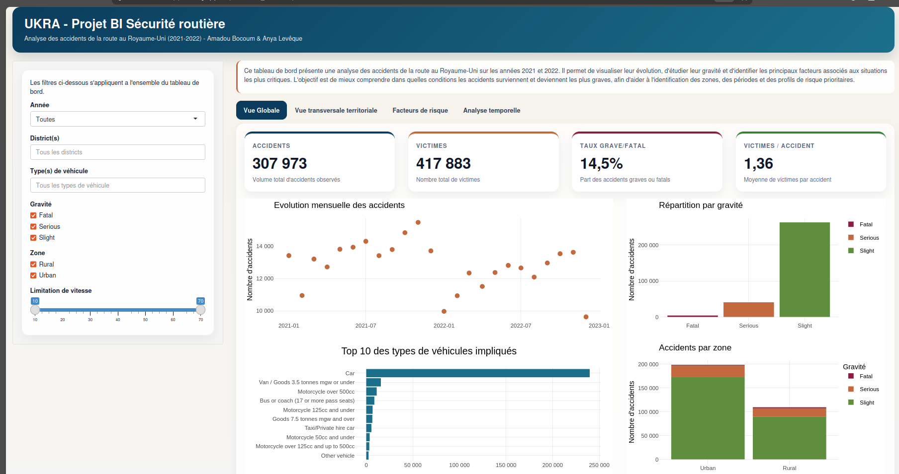
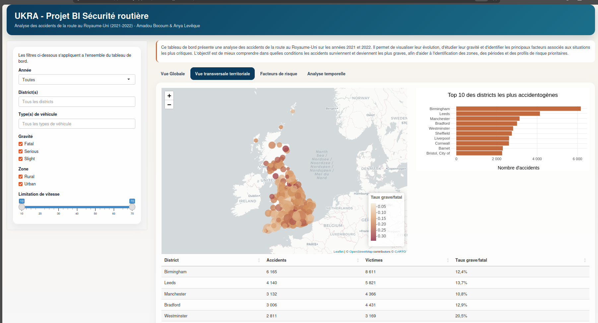
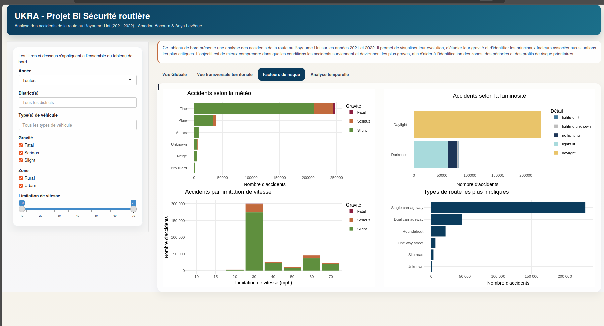
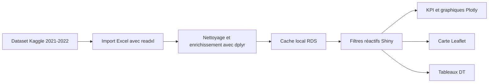

<div align="center">

# UKRA

### Tableau de bord BI sur les accidents routiers au Royaume-Uni

Analyse interactive des accidents recensés en 2021 et 2022 pour soutenir
l'identification des zones, périodes et conditions les plus à risque.

[](https://datascienceappli.shinyapps.io/Securite_routiere/)


</div>

[](https://datascienceappli.shinyapps.io/Securite_routiere/)

## Présentation

UKRA est une application de Business Intelligence développée avec **R Shiny**.
Elle transforme des données détaillées sur les accidents de la route en indicateurs
interactifs destinés à l'analyse décisionnelle.

Le tableau de bord répond à trois objectifs :

- fournir une vision synthétique du volume d'accidents, des victimes et de la gravité ;
- identifier les facteurs associés aux accidents graves ou mortels ;
- repérer les districts et les périodes présentant les niveaux de risque les plus élevés.

Le projet s'adresse principalement aux autorités nationales et locales chargées des
transports, aux acteurs de la sécurité routière et aux forces de police.

## Application en ligne

Le dashboard publié est accessible ici :

**[Ouvrir UKRA sur shinyapps.io](https://datascienceappli.shinyapps.io/Securite_routiere/)**

L'application propose des filtres communs sur l'année, le district, le type de
véhicule, la gravité, la zone urbaine ou rurale et la limitation de vitesse.
Toutes les visualisations se mettent à jour selon la sélection.

## Parcours analytique

| Vue | Question traitée | Principaux éléments |
| --- | --- | --- |
| **Vue globale** | Quelle est la situation générale ? | KPI, évolution mensuelle, gravité, véhicules et zones |
| **Vue territoriale** | Où les accidents sont-ils les plus nombreux ou les plus graves ? | Carte interactive, top 10 des districts et tableau détaillé |
| **Facteurs de risque** | Dans quelles conditions les accidents surviennent-ils ? | Météo, luminosité, vitesse et type de route |
| **Analyse temporelle** | Quand les accidents et les victimes sont-ils les plus fréquents ? | Jour, heure, mois, pics et comparaison mensuelle |

Les KPI principaux comprennent :

- le nombre total d'accidents ;
- le nombre total de victimes ;
- la part des accidents graves ou mortels ;
- le nombre moyen de victimes par accident.

## Aperçus

| Vue transversale territoriale | Facteurs de risque |
| :---: | :---: |
|  |  |

## Architecture



Le fichier source est préparé au premier lancement, puis enregistré dans
`road_accident_data.rds`. Ce cache est réutilisé tant qu'il reste plus récent que
le classeur Excel, ce qui réduit fortement le temps de démarrage lors des
lancements suivants.

## Technologies

- **R Shiny** pour l'application interactive ;
- **dplyr** et **lubridate** pour la préparation des données ;
- **ggplot2** et **Plotly** pour les visualisations ;
- **Leaflet** pour l'analyse cartographique ;
- **DT** pour les tableaux interactifs ;
- **readxl** pour l'import du classeur source.

## Données

Les données brutes ne sont pas incluses dans ce dépôt. Le fichier utilisé pour
réaliser le projet a été téléchargé depuis **Kaggle** :

**[Road Accident dataset - Kaggle](https://www.kaggle.com/datasets/xavierberge/road-accident-dataset)**

Le dataset Kaggle contient les versions Excel et CSV des données et est publié
sous licence **CC0: Public Domain**.

Après téléchargement, le fichier Excel `Road Accident Data.xlsx` doit être placé
à la racine du projet et renommé comme suit :

```text
Road_Accident_Data.xlsx
```

Ce fichier de travail doit être placé à la racine du projet. Il contient notamment
les dates et heures, la gravité, le nombre de victimes, les coordonnées, le
district, le véhicule, la route, la météo, la luminosité, la zone et la limitation
de vitesse.

> Le classeur Kaggle et le cache RDS sont volontairement exclus de Git afin de ne
> pas versionner un dataset volumineux. Le dépôt documente et exécute l'analyse,
> mais nécessite le téléchargement du fichier source pour un lancement local.

## Installation locale

Cloner le dépôt :

```bash
git clone https://github.com/Bocoum1/UKRA.git
cd UKRA
```

Installer les dépendances depuis R :

```r
install.packages(c(
  "shiny",
  "readxl",
  "dplyr",
  "ggplot2",
  "plotly",
  "leaflet",
  "DT",
  "lubridate",
  "scales"
))
```

Ajouter `Road_Accident_Data.xlsx` à la racine, puis lancer :

```bash
Rscript -e "shiny::runApp('.')"
```

Au premier démarrage, l'import et la création du cache peuvent prendre un peu de
temps. Les lancements suivants utilisent automatiquement le cache valide.

## Structure du dépôt

```text
.
├── app.R
├── README.md
├── Rapport_BI.pdf
└── screenshots/
    ├── facteurs-risque.png
    ├── vue-globale.png
    └── vue-territoriale.png
```

## Rapport BI

Le rapport présente l'environnement, le scénario BI, la perspective, la vue
transversale, les objectifs analytiques, les KPI et les facteurs influents.

**[Consulter le rapport BI](Rapport_BI.pdf)**

## Auteurs

- [Amadou Bocoum](https://github.com/Bocoum1)
- Anya Levêque
